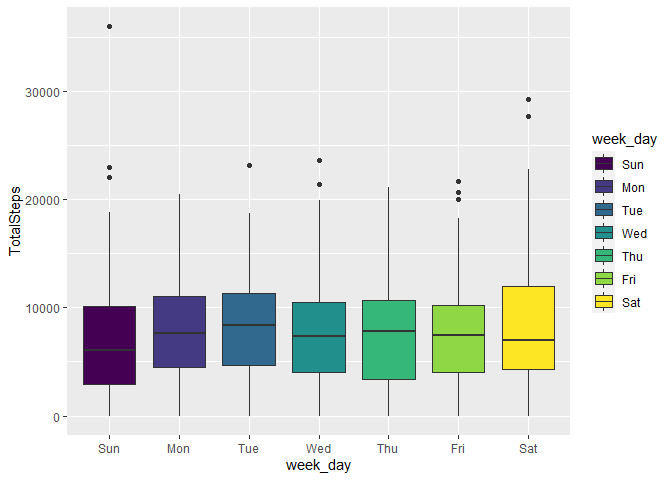
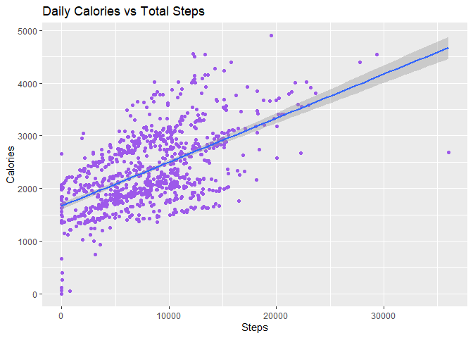
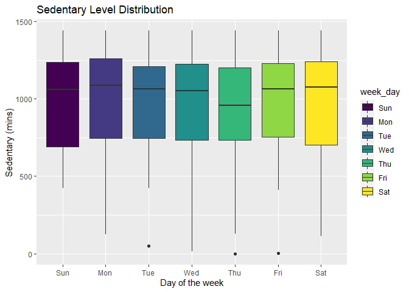
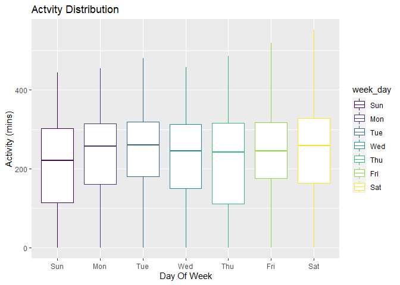
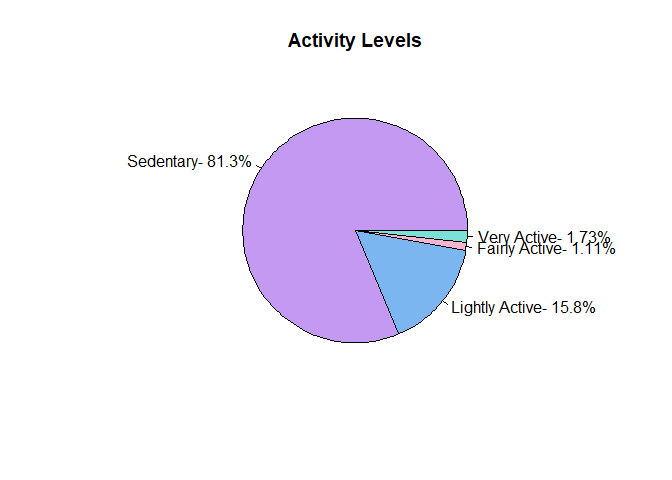
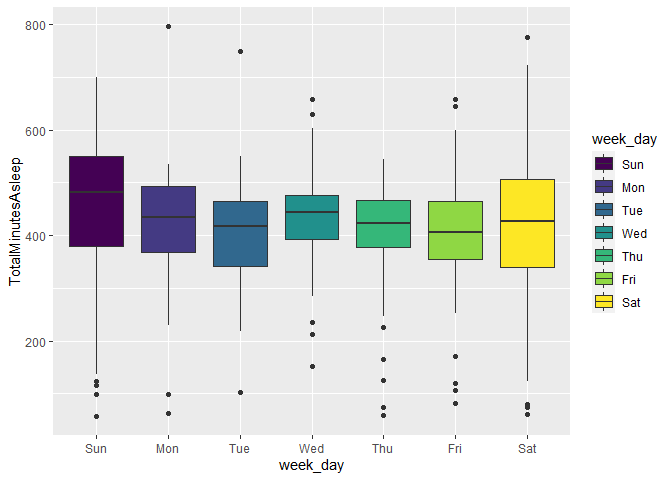
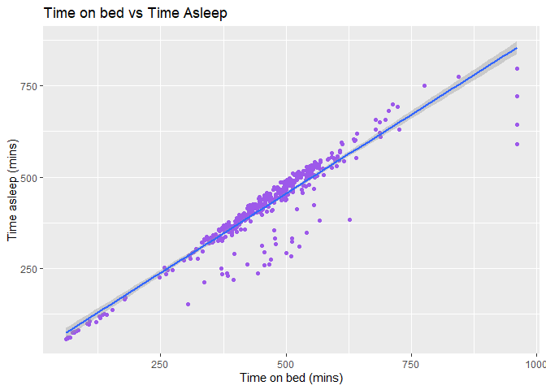
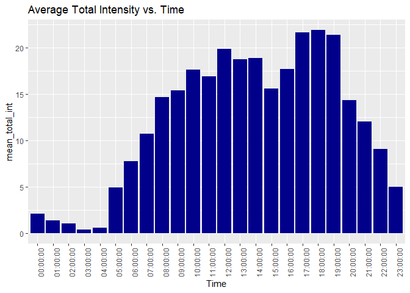

Bellabeat_Case_study
================
Rania Shaikh
01/04/2022

## Introduction To Case Study:

The following case study will involve data analysis for Bellabeat
company, a high tech manufacturer of health focused products for women.

## About Bellabeat

Urška Sršen and Sando Mur founded Bellabeat, a high-tech company that
manufactures health-focused smart products. Sršen used her background as
an artist to develop beautifully designed technology that informs and
inspires women around the world. Collecting data on activity, sleep,
stress, and reproductive health has allowed Bellabeat to empower women
with knowledge about their own health and habits. Since it was founded
in 2013, Bellabeat has grown rapidly and quickly positioned itself as a
tech-driven wellness company for women.

Products offered by the company includes:

-   Bellabeat Leaf

-   Bellabeat Time

-   Bellabeat Spring

## Phases of data analysis

1.  Ask

2.  Prepare

3.  Process

4.  Analyze

5.  Share

6.  Act

### 1. Ask

**1.Business Task**

-   To analyze smart device usage data of non bellabeat consumers in
    order to gain insights about consumers using their smart devices.
-   These insights will help marketing team to come up with new
    marketing strategies for the company.

**2.Stakeholders**

-   **Urška Sršen** : Bellabeat’s cofounder and Chief Creative Office.

-   **Sando Mur**: Mathematician and Bellabeat’s co-founder; key member
    of the Bellabeat executive team

-   **Bellabeat marketing analytics team**: A team of data analysts
    responsible for collecting, analyzing, and reporting data that helps
    guide Bellabeat’s marketing strategy.

**3.The analysis of this data will help us to understand:**

-   What are some trends in smart device usage?

-   How could these trends apply to Bellabeat customers?

-   How could these trends help influence Bellabeat marketing strategy?

### 2. Prepare

**1.Data Credibility:**

-   FitBit Fitness Tracker Data is used for the analysis derived from
    public domain (CC0: Public Domain) made available through Mobius on
    kaggle. Thus, it is an open source dataset.

-   This dataset generated by respondents to a distributed survey via
    Amazon Mechanical Turk between 03.12.2016-05.12.2016.

-   Thirty eligible Fitbit users consented to the submission of personal
    tracker data, including minute-level output for physical activity,
    heart rate, and sleep monitoring.

-   It includes information about daily activity, steps, sleep and heart
    rate that can be used to explore users habits.

**2.Data Organization:**

-   This particular dataset consist of 18 tables in csv format.

**3.Data bias:**

-   The Dataset consist information related to only 30 users, age group
    is not defined and there is no information related to gender (as
    company focuses on women related products) .

**4.Data integrity:**

-   Before Starting the analysis it is necessary to ensure that data is
    complete and consistent for complete analysis.

**5.Tools**

-   This case study will involve the use of R as tool for prepare,
    process, analysis and visualising the data.

**Loading Packages**

``` r
library(tidyverse)
```

    ## -- Attaching packages --------------------------------------- tidyverse 1.3.1 --

    ## v ggplot2 3.3.5     v purrr   0.3.4
    ## v tibble  3.1.6     v dplyr   1.0.8
    ## v tidyr   1.2.0     v stringr 1.4.0
    ## v readr   2.1.1     v forcats 0.5.1

    ## -- Conflicts ------------------------------------------ tidyverse_conflicts() --
    ## x dplyr::filter() masks stats::filter()
    ## x dplyr::lag()    masks stats::lag()

``` r
library(lubridate)
```

    ## 
    ## Attaching package: 'lubridate'

    ## The following objects are masked from 'package:base':
    ## 
    ##     date, intersect, setdiff, union

``` r
library(skimr)
```

**Importing Data sets**

``` r
daily_activity <- read_csv("~/fitbit_fitness_tracker/Fitabase Data 4.12.16-5.12.16/dailyActivity_merged.csv")
```

    ## Rows: 940 Columns: 15
    ## -- Column specification --------------------------------------------------------
    ## Delimiter: ","
    ## chr  (1): ActivityDate
    ## dbl (14): Id, TotalSteps, TotalDistance, TrackerDistance, LoggedActivitiesDi...
    ## 
    ## i Use `spec()` to retrieve the full column specification for this data.
    ## i Specify the column types or set `show_col_types = FALSE` to quiet this message.

``` r
daily_sleep <- read_csv("~/fitbit_fitness_tracker/Fitabase Data 4.12.16-5.12.16/sleepDay_merged.csv")
```

    ## Rows: 413 Columns: 5
    ## -- Column specification --------------------------------------------------------
    ## Delimiter: ","
    ## chr (1): SleepDay
    ## dbl (4): Id, TotalSleepRecords, TotalMinutesAsleep, TotalTimeInBed
    ## 
    ## i Use `spec()` to retrieve the full column specification for this data.
    ## i Specify the column types or set `show_col_types = FALSE` to quiet this message.

``` r
intensities <- read_csv("~/fitbit_fitness_tracker/Fitabase Data 4.12.16-5.12.16/hourlyIntensities_merged.csv")
```

    ## Rows: 22099 Columns: 4
    ## -- Column specification --------------------------------------------------------
    ## Delimiter: ","
    ## chr (1): ActivityHour
    ## dbl (3): Id, TotalIntensity, AverageIntensity
    ## 
    ## i Use `spec()` to retrieve the full column specification for this data.
    ## i Specify the column types or set `show_col_types = FALSE` to quiet this message.

**Data Structure**

1.  For daily activity data set

``` r
head(daily_activity)
```

    ## # A tibble: 6 x 15
    ##        Id ActivityDate TotalSteps TotalDistance TrackerDistance LoggedActivitie~
    ##     <dbl> <chr>             <dbl>         <dbl>           <dbl>            <dbl>
    ## 1  1.50e9 4/12/2016         13162          8.5             8.5                 0
    ## 2  1.50e9 4/13/2016         10735          6.97            6.97                0
    ## 3  1.50e9 4/14/2016         10460          6.74            6.74                0
    ## 4  1.50e9 4/15/2016          9762          6.28            6.28                0
    ## 5  1.50e9 4/16/2016         12669          8.16            8.16                0
    ## 6  1.50e9 4/17/2016          9705          6.48            6.48                0
    ## # ... with 9 more variables: VeryActiveDistance <dbl>,
    ## #   ModeratelyActiveDistance <dbl>, LightActiveDistance <dbl>,
    ## #   SedentaryActiveDistance <dbl>, VeryActiveMinutes <dbl>,
    ## #   FairlyActiveMinutes <dbl>, LightlyActiveMinutes <dbl>,
    ## #   SedentaryMinutes <dbl>, Calories <dbl>

``` r
glimpse(daily_activity)
```

    ## Rows: 940
    ## Columns: 15
    ## $ Id                       <dbl> 1503960366, 1503960366, 1503960366, 150396036~
    ## $ ActivityDate             <chr> "4/12/2016", "4/13/2016", "4/14/2016", "4/15/~
    ## $ TotalSteps               <dbl> 13162, 10735, 10460, 9762, 12669, 9705, 13019~
    ## $ TotalDistance            <dbl> 8.50, 6.97, 6.74, 6.28, 8.16, 6.48, 8.59, 9.8~
    ## $ TrackerDistance          <dbl> 8.50, 6.97, 6.74, 6.28, 8.16, 6.48, 8.59, 9.8~
    ## $ LoggedActivitiesDistance <dbl> 0, 0, 0, 0, 0, 0, 0, 0, 0, 0, 0, 0, 0, 0, 0, ~
    ## $ VeryActiveDistance       <dbl> 1.88, 1.57, 2.44, 2.14, 2.71, 3.19, 3.25, 3.5~
    ## $ ModeratelyActiveDistance <dbl> 0.55, 0.69, 0.40, 1.26, 0.41, 0.78, 0.64, 1.3~
    ## $ LightActiveDistance      <dbl> 6.06, 4.71, 3.91, 2.83, 5.04, 2.51, 4.71, 5.0~
    ## $ SedentaryActiveDistance  <dbl> 0, 0, 0, 0, 0, 0, 0, 0, 0, 0, 0, 0, 0, 0, 0, ~
    ## $ VeryActiveMinutes        <dbl> 25, 21, 30, 29, 36, 38, 42, 50, 28, 19, 66, 4~
    ## $ FairlyActiveMinutes      <dbl> 13, 19, 11, 34, 10, 20, 16, 31, 12, 8, 27, 21~
    ## $ LightlyActiveMinutes     <dbl> 328, 217, 181, 209, 221, 164, 233, 264, 205, ~
    ## $ SedentaryMinutes         <dbl> 728, 776, 1218, 726, 773, 539, 1149, 775, 818~
    ## $ Calories                 <dbl> 1985, 1797, 1776, 1745, 1863, 1728, 1921, 203~

2.  For daily sleep data set

``` r
head(daily_sleep)
```

    ## # A tibble: 6 x 5
    ##           Id SleepDay           TotalSleepRecor~ TotalMinutesAsl~ TotalTimeInBed
    ##        <dbl> <chr>                         <dbl>            <dbl>          <dbl>
    ## 1 1503960366 4/12/2016 12:00:0~                1              327            346
    ## 2 1503960366 4/13/2016 12:00:0~                2              384            407
    ## 3 1503960366 4/15/2016 12:00:0~                1              412            442
    ## 4 1503960366 4/16/2016 12:00:0~                2              340            367
    ## 5 1503960366 4/17/2016 12:00:0~                1              700            712
    ## 6 1503960366 4/19/2016 12:00:0~                1              304            320

``` r
glimpse(daily_sleep)
```

    ## Rows: 413
    ## Columns: 5
    ## $ Id                 <dbl> 1503960366, 1503960366, 1503960366, 1503960366, 150~
    ## $ SleepDay           <chr> "4/12/2016 12:00:00 AM", "4/13/2016 12:00:00 AM", "~
    ## $ TotalSleepRecords  <dbl> 1, 2, 1, 2, 1, 1, 1, 1, 1, 1, 1, 1, 1, 1, 1, 1, 1, ~
    ## $ TotalMinutesAsleep <dbl> 327, 384, 412, 340, 700, 304, 360, 325, 361, 430, 2~
    ## $ TotalTimeInBed     <dbl> 346, 407, 442, 367, 712, 320, 377, 364, 384, 449, 3~

3.  for intensities data set

``` r
head(intensities)
```

    ## # A tibble: 6 x 4
    ##           Id ActivityHour          TotalIntensity AverageIntensity
    ##        <dbl> <chr>                          <dbl>            <dbl>
    ## 1 1503960366 4/12/2016 12:00:00 AM             20            0.333
    ## 2 1503960366 4/12/2016 1:00:00 AM               8            0.133
    ## 3 1503960366 4/12/2016 2:00:00 AM               7            0.117
    ## 4 1503960366 4/12/2016 3:00:00 AM               0            0    
    ## 5 1503960366 4/12/2016 4:00:00 AM               0            0    
    ## 6 1503960366 4/12/2016 5:00:00 AM               0            0

``` r
glimpse(intensities)
```

    ## Rows: 22,099
    ## Columns: 4
    ## $ Id               <dbl> 1503960366, 1503960366, 1503960366, 1503960366, 15039~
    ## $ ActivityHour     <chr> "4/12/2016 12:00:00 AM", "4/12/2016 1:00:00 AM", "4/1~
    ## $ TotalIntensity   <dbl> 20, 8, 7, 0, 0, 0, 0, 0, 13, 30, 29, 12, 11, 6, 36, 5~
    ## $ AverageIntensity <dbl> 0.333333, 0.133333, 0.116667, 0.000000, 0.000000, 0.0~

### 3. Prepare

-   This section involves cleaning data to ensure data integrity.

1.  Number of participants in each data set

``` r
n_distinct(daily_activity$Id)
```

    ## [1] 33

``` r
n_distinct(daily_sleep$Id)
```

    ## [1] 24

``` r
n_distinct(intensities$Id)
```

    ## [1] 33

-   There are only 24 participants in daily sleep data and 33
    participants in rest of the data sets.

2.  Checking for missing/NA values

``` r
sum(is.na(daily_activity))
```

    ## [1] 0

``` r
sum(is.na(daily_sleep))
```

    ## [1] 0

``` r
sum(is.na(intensities))
```

    ## [1] 0

-   There are no NA values in any of the data set.

3.  Checking for duplicated values in the data set

``` r
sum(duplicated(daily_activity))
```

    ## [1] 0

``` r
sum(duplicated(daily_sleep))
```

    ## [1] 3

``` r
sum(duplicated(intensities))
```

    ## [1] 0

-   There are duplicate values in sleep data set

``` r
daily_sleep <- unique(daily_sleep)
```

-   Ensuring data set is free from duplicate values

``` r
sum(duplicated(daily_sleep))
```

    ## [1] 0

4.  Renaming the date variable for each data set and then changing the
    format

``` r
daily_activity <- daily_activity%>% rename(Date = ActivityDate)
daily_sleep <- daily_sleep %>% rename(Date = SleepDay)
intensities <- intensities %>% rename(Date_time = ActivityHour)
```

-   Ensuring correct changes are made

``` r
colnames(daily_activity)
```

    ##  [1] "Id"                       "Date"                    
    ##  [3] "TotalSteps"               "TotalDistance"           
    ##  [5] "TrackerDistance"          "LoggedActivitiesDistance"
    ##  [7] "VeryActiveDistance"       "ModeratelyActiveDistance"
    ##  [9] "LightActiveDistance"      "SedentaryActiveDistance" 
    ## [11] "VeryActiveMinutes"        "FairlyActiveMinutes"     
    ## [13] "LightlyActiveMinutes"     "SedentaryMinutes"        
    ## [15] "Calories"

``` r
colnames(daily_sleep)
```

    ## [1] "Id"                 "Date"               "TotalSleepRecords" 
    ## [4] "TotalMinutesAsleep" "TotalTimeInBed"

``` r
colnames(intensities)
```

    ## [1] "Id"               "Date_time"        "TotalIntensity"   "AverageIntensity"

-   In the above section when we looked at data structure it can be seen
    that date in all the data set is in character format we have to
    convert it in to date format.

``` r
daily_activity$Date <- mdy(daily_activity$Date)
daily_sleep$Date <-mdy_hms(daily_sleep$Date)
```

``` r
intensities$Date_time=as.POSIXct(intensities$Date_time, format="%m/%d/%Y %I:%M:%S %p", tz=Sys.timezone())
intensities$Time <- format(intensities$Date_time, format = "%H:%M:%S")
intensities$Date <- format(intensities$Date_time, format = "%m/%d/%y")
```

### 5. Analyze

-   This section involves summarizing data sets.

**1. Analyzing daily activity of the users:**

``` r
## Summarizing the activity of the users
daily_activity %>% select(TotalSteps, Calories)%>% summary()
```

    ##    TotalSteps       Calories   
    ##  Min.   :    0   Min.   :   0  
    ##  1st Qu.: 3790   1st Qu.:1828  
    ##  Median : 7406   Median :2134  
    ##  Mean   : 7638   Mean   :2304  
    ##  3rd Qu.:10727   3rd Qu.:2793  
    ##  Max.   :36019   Max.   :4900

``` r
daily_activity %>% select(SedentaryMinutes, VeryActiveMinutes, FairlyActiveMinutes, LightlyActiveMinutes) %>% summary()
```

    ##  SedentaryMinutes VeryActiveMinutes FairlyActiveMinutes LightlyActiveMinutes
    ##  Min.   :   0.0   Min.   :  0.00    Min.   :  0.00      Min.   :  0.0       
    ##  1st Qu.: 729.8   1st Qu.:  0.00    1st Qu.:  0.00      1st Qu.:127.0       
    ##  Median :1057.5   Median :  4.00    Median :  6.00      Median :199.0       
    ##  Mean   : 991.2   Mean   : 21.16    Mean   : 13.56      Mean   :192.8       
    ##  3rd Qu.:1229.5   3rd Qu.: 32.00    3rd Qu.: 19.00      3rd Qu.:264.0       
    ##  Max.   :1440.0   Max.   :210.00    Max.   :143.00      Max.   :518.0

**Observations from summary**

1.  The users took 7,638 steps on an average per day.
2.  The users spend 991 mins (16 hours) sedentary on an average per day.
3.  The users spend approximately 21 mins very active, 13 mins fairly
    active and 192 mins lightly active per day.

**2. Analyzing sleeping habits of the users:**

``` r
## summarizing daily_sleep data

## Adding a variable to the data set before analysis
daily_sleep <- daily_sleep %>% select(Id, Date, TotalSleepRecords, TotalMinutesAsleep, TotalTimeInBed) %>% 
  mutate(Time_in_bed = TotalTimeInBed - TotalMinutesAsleep)

## Analysis
daily_sleep %>% select(TotalMinutesAsleep, TotalTimeInBed, Time_in_bed) %>% summary()
```

    ##  TotalMinutesAsleep TotalTimeInBed   Time_in_bed    
    ##  Min.   : 58.0      Min.   : 61.0   Min.   :  0.00  
    ##  1st Qu.:361.0      1st Qu.:403.8   1st Qu.: 17.00  
    ##  Median :432.5      Median :463.0   Median : 25.50  
    ##  Mean   :419.2      Mean   :458.5   Mean   : 39.31  
    ##  3rd Qu.:490.0      3rd Qu.:526.0   3rd Qu.: 40.00  
    ##  Max.   :796.0      Max.   :961.0   Max.   :371.00

**Observations from the summary**

1.  Users slept for around 7 hours per day.
2.  Users spend around 39 mins on bed when not asleep.

## 6.Share

-   This section involves visualizing important information in data set
    through plots.

**1. Visualizing users steps according to days of the week.**

``` r
## Adding variable to the daily_activity data set
daily_activity <- daily_activity %>% mutate(week_day = wday(Date, label =T) )

##Visualizing the data
ggplot(data = daily_activity)+ geom_boxplot(mapping = aes(x= week_day, y= TotalSteps, fill = week_day))
```

<!-- -->

**The above box plot shows that the users took more steps Tuesdays and
Thursdays and least steps on Mondays**

**2. Correlation between Total Steps and Calories burned**

``` r
## Determining the correlation coefficient between the variables
steps <- daily_activity$TotalSteps
calories <- daily_activity$Calories
cor(steps,calories)
```

    ## [1] 0.5915681

-   The correlation coefficient is close to 1 means there is positive
    correlation between the variables

``` r
ggplot(daily_activity, aes(x = TotalSteps, y = Calories))+
  geom_point(color = "#9D59EA")+
  geom_smooth(method = "lm")+
  labs(title = "Daily Calories vs Total Steps", x = "Steps", y = "Calories")
```

    ## `geom_smooth()` using formula 'y ~ x'

<!-- -->

**The above plot shows that increasing daily steps will improve calories
burn**

**3. Users sedentary behavior according to days of the week**

``` r
ggplot(daily_activity,aes(x=week_day,y=SedentaryMinutes, fill = week_day))+
geom_boxplot() + labs(title = 'Sedentary Level Distribution', x='Day of the week',y = 'Sedentary (mins)')
```

<!-- -->

**The above plot Sedentary Level shows that the users were more
sedentary on Mondays and Fridays as compared to Saturdays and Sundays.**

**4. Users activity level according to days of week (not considering
sedentary variable)**

``` r
daily_activity <- daily_activity %>% mutate(Activity_mins = VeryActiveMinutes+FairlyActiveMinutes+LightlyActiveMinutes )

ggplot(data = daily_activity)+
geom_boxplot(mapping= aes(x=week_day, y=Activity_mins,color= week_day))+
labs(title = 'Actvity Distribution', x = 'Day Of Week', y = 'Activity (mins)' )
```

<!-- -->

**The above plot Total Activity Distribution shows that the users were
more active on Saturdays.**

**5. Range of users activity level**

``` r
very <- sum(daily_activity$VeryActiveMinutes)
fair <-  sum(daily_activity$FairlyActiveMinutes)
light <-  sum(daily_activity$LightlyActiveMinutes)
sed <-  sum(daily_activity$SedentaryMinutes)
total_minutes <- light+sed+fair+very
#calculate percentages
sed_per <- sed/total_minutes
light_per <- light/total_minutes
fair_per <- fair/total_minutes
very_per <- very/total_minutes
#assign slices and labels
slices <- c(sed_per,light_per,fair_per,very_per)
lbls <- c("Sedentary- 81.3%", "Lightly Active- 15.8%", "Fairly Active- 1.11%", "Very Active- 1.73%")
#create pie chart
pie <- pie(slices, labels = lbls, main = "Activity Levels", col = c("#C399F2","#7BB6F0","#F6B4D0","#7BE0D6"))
```

<!-- -->

**The above pie chart shows that users were more sedentary and less
active.**

**6. Users sleep pattern according to days of the week**

``` r
## Adding a variable to the sleep data set0
daily_sleep <- daily_sleep %>% mutate(week_day = wday(Date, label =T))
ggplot(data=daily_sleep)+ geom_boxplot(mapping = aes(x= week_day, y= TotalMinutesAsleep, fill = week_day))
```

<!-- -->

**The above plot shows that user slept more on Sundays and Wednesdays on
average and slept least on Fridays.**

**7. Correlation between Total minutes asleep and total time in bed**

``` r
## Calculating correlation coefficient between variables
asleep <- daily_sleep$TotalMinutesAsleep
on_bed <- daily_sleep$TotalTimeInBed
cor(asleep,on_bed)
```

    ## [1] 0.9304224

-   The correlation coefficient is close to 1, it means a strong
    positive correlation between the variables.

``` r
ggplot(daily_sleep, aes(x = TotalTimeInBed, y = TotalMinutesAsleep))+
  geom_point(color = "#9D59EA")+
  geom_smooth(method = "lm")+
  labs(title = "Time on bed vs Time Asleep", x = "Time on bed (mins)", y = "Time asleep (mins)")
```

    ## `geom_smooth()` using formula 'y ~ x'

<!-- -->

**The plot shows when users goes early to bed they get a better sleep.**

**8. Intensities data over time**

``` r
int_new <- intensities %>%
  group_by(Time) %>%
  drop_na() %>%
  summarise(mean_total_int = mean(TotalIntensity))

ggplot(data=int_new, aes(x=Time, y=mean_total_int)) + geom_histogram(stat = "identity", fill='darkblue') +
  theme(axis.text.x = element_text(angle = 90)) +
  labs(title="Average Total Intensity vs. Time")
```

    ## Warning: Ignoring unknown parameters: binwidth, bins, pad

<!-- -->

**The above plot shows that the users were more active at 4:00 pm
,5:00pm and 6:00 pm.**

## 7.Act

-   This section involves highlighting insights observed from the
    visualization and analysis phase.

**Key Findings**

1.  The users were more sedentary on Mondays and Fridays and on
    average/day spends 16 hours sedentary.

2.  The users were more active on Saturdays and were very active for 23
    mins on average/day.

3.  The users took more steps on Tuesdays and Thursdays and least steps
    on Sundays and took only 8,319 steps on an average/day.

4.  The users got a maximum sleep on Sundays and least amount of sleep
    on Fridays and sleep for approx 7 hours on average/day.

5.  The users spends 39.31 mins/day resting (when they are not asleep).

6.  The users were more active at 4pm, 5pm and 6pm.

**Correlation**

1.  The correlation coefficient between Total steps and Calories
    variable is close to 1, means increasing daily steps will improve
    calories burn.

2.  The correlation coefficient between Total time in bed and Total
    minutes asleep is close to 1, it means when users goes early to bed
    they get a better sleep.

**Recommendations for marketing strategies**

-   On the basis of the analysis it can be seen that users have a
    sedentary behavior and perform less activities, thus the bellabeat
    devices can help the users in the following ways:

1.  The device can have a goal tracker which help the users to perform
    proper daily exercises and activities. The device can also suggest
    exercises that can be performed at home during free times.

2.  The device than can consist of a habit tracker providing information
    to the users about the new habits (good/bad) they have developed on
    the basis of activities performed dring 21 days.

3.  The device can have a notification system informing the users about
    their goals to achieve.

4.  The users can also recommend the steps that need to be taken in
    order to burn their calories in a appropriate amount.

-   The analysis also provided users sleep pattern and the bellabeat
    device can help the users in the following ways:

1.  The device can provide the sleep pattern report of the users on
    weekly basis consisting the information about their sleep type (REM
    and non-REM).

2.  It can also generate some type of notifications when the users are
    resting for more than 30 minutes doing nothing leading to sedentary
    behaviour.
